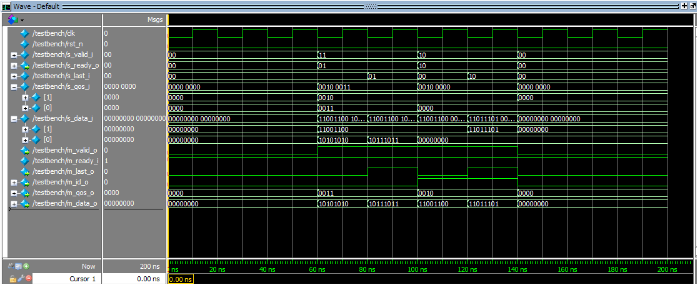

# Кодирование и bring-up тест
Разработанное устройство включает в себя 4 SystemVerilog-модуля, а также файл тестового окружения.
- DC — модуль, описывающий параметрический дешифратор;
- MUX — модуль, описывающий параметрический мультиплексор с параметрической разрядностью данных;
- id_selector — описывает блок выбора приоритета, представляет собой комбинационную схему, определяющую номер входого потока на основе его значения QoS;
- stream_arbiter — модуль верхнего уровня;
- testbench — файл тестового окружения.

## Тестирование
Устройство было протестировано в симуляции ModelSim при помощи файла тестового окружения, имитирующего поведение master-устройства и slave-устройства.  
Для тестирования со slave-устройства были одновременно переданы следующие пакеты транзакций по двум входным потокам:
1. QoS = 3; data = 8'hAA, 8'hBB.
2. QoS = 2; data = 8'hCC, 8'hDD.

Результаты тестирования представлены в виде временной диаграммы на рисунке:  

