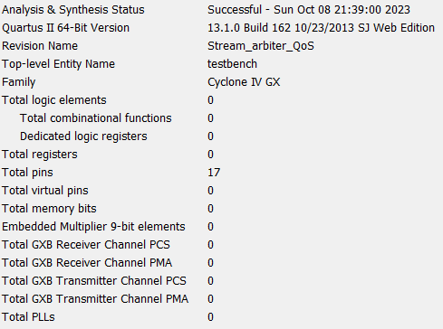

# Тестовый синтез
Разработанное устройство было синтезировано для ПЛИС EPCGX15BF14A7 семейства Cyclone IV GX.

Порядок запуска тестового синтеза:
1. Создать проект в САПР Quartus II.
2. Добавить в проект все SystemVerilog-файлы из репозитория.
3. Указать файл stream_arbiter.sv как модуль верхнего уровня.
4. Task > Compile Design > Analysis & Synthesis

Отчет о тестовом синтезе для указанной ПЛИС представлен на рисунке:

